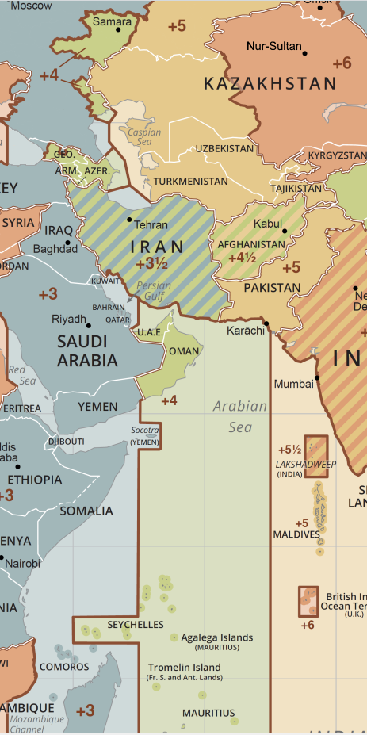

```{r, warning=FALSE, message = FALSE}
library(lubridate)
library(ggplot2)
library(plotly)
library(dplyr)
library(reactable)
```

# Intro 

Do Kwon, i.e., @ stablekwon on Twitter is on the run and has fled Singapore after 
orchestrating a Ponzi Scheme via the Terra blockchain. While warned numerous times
that the system had a fatal death spiral design flaw in the way the "stablecoin" TerraUSD (commonly
referred to as UST) relied near exclusively on the price of LUNA (the Terra blockchain's utility 
token for paying for blockchain transactions) as its backing.

To summarize the economics, the Terra blockchain had demand for its blockspace. People 
wanted to store data, run computations, and alter their token balances on the Terra blockchain. 
In order to do so, they purchased and expended LUNA tokens as payment to a decentralized network 
of computers that validated the transactions (i.e., you aren't using someone else's tokens; you're not 
asking for \$100,000 worth of product or services with only \$10 of tokens).

Speculation in crypto was rampant from 2020 - 2022, including on the Terra blockchain. Numerous 
people worldwide "invested" in LUNA as a proxy for investing in the Terra blockchain. As LUNA's 
value grew, it was possible to mint more and more UST per LUNA. \$10 of LUNA could back 10 UST (1 UST = \$1).
If 1 LUNA went from \$10 to \$100, as it actually did; the same amount of LUNA tokens could suddenly 
mint significantly more UST.

This had a feedback loop where 1 LUNA being able to access higher value debt tokens (1 UST = \$1 worth of LUNA) 
fed itself into a frenzy.

This speculation alone was not enough to cause catastrophic problems, as eventually the market would find equilibrium and prices would crash to some "real" value - i.e., how much is the Terra blockchain (not speculation on that blockchain) actually worth? i.e., what is the natural expenditure of LUNA for its direct use as payment for blockspace?

The catastrophe came from inappropriate marketing and unsustainable use cases for UST. Specifically, Anchor protocol. Anchor protocol and the Terra foundation backing it (among other protocols on the Terra blockchain) marketed themselves as a new kinds of savings account, specifically that UST would = $1 securely (obscuring the fact that 1 UST *actually* equals \$1 *worth* of LUNA). This subtle omission hides the fundamental problem: 
for LUNA to be *worth* \$1 means that *there is an assumed buyer of LUNA* somewhere in the value chain.

To grow the demand (and speculation) for the Terra blockchain, Anchor protocol offered an enticing and unsustainable 20% APR on UST. This, during the lowest 10+ year period of US federal interest rates in history, with normal checking accounts routinely offering 1/100th of this rates (i.e., 0.2% at best).

Many "investors" in UST (1) had little to no understanding that their UST was backed by (demand for) the LUNA token; (2) did understand this rate was unsustainable. They expected it to go down over time to some realistic amount, but were willing to put in money as they assumed Venture Capital funds were effectively buying customers with a temporary, sky high rate.

It later came out, that this was Do Kwon's *second* venture into "algorithmically backed" stablecoins, having developed Basis Cash in 2020 to its similar death in 2021 under the pseudonym 'Rick Sanchez'.

Of course, algorithms are not to blame. The reason these tokens failed is because they *lied* about their backing. UST was not backed by "algorithms" it was backed by demand for the Terra blockchain, i.e., the *assumed buyer* of LUNA.

This obscurity of the relationship between UST and demand for LUNA set up a catastrophe, commonly understood as the 'market cap problem'. 

Market Cap is a the price of an item, times the amount of the item that exists, e.g., price of Facebook stock times the amount of facebook stock. As prices fall, Market Cap also falls. As supply increase, Market Cap also increases (assuming price does not change). 

The Market Cap of UST reached over $30,000,000,000 at its peak. The Market Cap of LUNA also reached over
$30,000,000,000 at its peak. 

But, as you may be realizing, this is double dipping. The market cap of UST is *backed by* the market cap of LUNA. Because 1 UST does not equal \$1. 1 UST equals \$1 *worth* of LUNA *assuming there is a buyer of LUNA*.

As crypto demand cooled in 2022, Terra blockspace demand also cooled. The price of LUNA cooled, which meant a reduction in its market cap. The obvious and well documented in advance by a variety of economists and commentators in the crypto space was a *bank run*. If demand for LUNA is falling, then the backing of UST is falling to. There was a rush to real dollars: Central Exchanges had large sell-offs of UST into government currencies (USD, Euro, etc.); Decentralized Exchanges had large sell-offs of UST into tokenized government currencies (Circle USDC, Tether USDT, Binance BUSD, etc.). 

This collapse took down numerous centralized crypto hedge funds and products: Celsius, 3 Arrows Capital (3AC), 
among others. Funds that took investor money, claiming to be savvy traders and users of Decentralized Finance, when they really just threw the money into Anchor Protocol for 20% APR and gave their clients half of it (10%) keeping the rest for themselves.

# Current Situation 

As of September 28th, where this data and analysis is based, Do Kwon has arrest warrants in South Korea (where UST was heavily marketed and Terra blockchain disproportionately popular), International Police searching for him in Singapore (they claim he is no longer there and has fled) and is generally in hiding. 

The goal of this analysis is to support law enforcement in locating him with 

# Data 

3,196 Tweets from June 16, 2021 to September 28, 2022 by Do Kwon (including replies and retweets), were pulled from Twitter. 0 of these tweets had geo-location enabled and thus there are no Twitter provided coordinates available. Nonetheless, given time and frequency of tweets, a few noticeable shifts in behavior were identified that may be useful for law enforcement. 

This data is available in the following formats: 

- DoKwon_tweets_Sep28.json: All available tweet data, excluding variables that were 100% NA (e.g., coordinates). In JSON format. 
- DoKwon_tweets_formatted.csv: A select view of available tweet data in easy to read CSV format. 
- DoKwon_tweets_type_preserved_R_file.rds: the csv above, but with specifications to preserve data column 
type in the R programming language (i.e., has more nuance no how to read dates).

The data available in the main formatted file include:

```{r, warning=FALSE, message = FALSE}
terra_crash <- as.Date("2022-05-08")
terra_interview <- as.Date("2022-08-15")
# preserve date format 
tweet_text <- readRDS("DoKwon_tweets_type_preserved_R_file.rds")

reactable(
  data.frame(
    "Column" = colnames(tweet_text),
    "Definition" = c(
      "EST Time of Tweet Created",
      "Tweet Text Preview",
      "Full Tweet Text",
      "If the tweet is a Reply, who it is in reply to",
      "Device used (i.e., iPad, Web App, iPhone)",
      "EST Time in better date format",
      "Time in Singapore when Tweet Created",
      "Hour of time in Singaore (i.e., 12am = 0, 11pm = 23)",
      "The day of tweet in Singapore time",
      "Whether tweet was pre-UST collapse (on or before 2022-05-07), 
      in between his Coinage interview (2022-05-08 - 2022-08-14), 
      or after the Coinage Interview (2022-08-15 - 2022-09-28)"
    )
  )
)
```

# General Tweet Pattern

As expected his tweets have significantly changed since the De-Peg. 
Prior to the De-peg (red line), he rarely tweeted from midnight - 5am Singapore time. Mostly 
tweeting in the early afternoon to 8pm time period. But with regular tweets in the early morning (5am - 10am)
and late evening (8pm - midnight).

After the De-peg but before the Coinage interview went live, the 5am - 10am Singapore time almost completely empties out and the unusual pattern arises: more tweet density in the 0 - 5am Singapore time slot and 
more concentration in the 10am - 3pm SGT time. 

After the Coinage interview (black line), his tweets are almost exclusively in the 8pm - 5am 
Singapore hours (the bottom 0-5 and top 20-23 sections of chart).

This supports the claim that he is no longer in Singapore - but also that he is not in the 
China, Southeast Asia, Phillipines, Korea regions at all!

```{r, warning=FALSE, message = FALSE}

vline <- function(x = 0, color = "black") {
  list(
    type = "line",
    y0 = 0,
    y1 = 1,
    yref = "paper",
    x0 = x,
    x1 = x,
    line = list(color = color, dash="dot")
  )
}
tweet_days <- tweet_text %>% group_by(day, SGT_hour, .add = TRUE) %>% summarise(num_tweets = n())

plot_ly(data = tweet_days, x = ~day) %>% 
  add_markers(y = ~SGT_hour, 
              mode = 'marker',
              type = 'scatter',
              marker = list(size = ~num_tweets),
              text = ~paste0("Day: ", day,
                            "\nHour: ", SGT_hour,
                            "\n# Tweets: ", num_tweets),
              hoverinfo = 'text') %>% 
  layout(title = "Do Kwon Twitter Activity w/ UST Depeg & Coinage Interview Noted",
         shapes = list(vline(terra_crash, color = 'red'), 
                       vline(terra_interview, color = 'black')),
         xaxis = list(title = "Day"),
         yaxis = list(title = "Hour in Singapore"))

```


# A Quantifiable shift of 4 Hours West 

Breaking his tweet activity across Pre-Depeg, Pre-Interview, and Post-Public Interview in 
boxplot format (and placing the points next to the plot) makes this difference very stark.

The 5am - 10am Singapore time period is empty post-Public Interview. And there is significant 
concentration in the 8pm (20) to 5am (5) hours. 

Because of the way the chart is formatted, the yellow boxplot may be a bit confusing because it is so wide.

The best way to read it is to look at the top of the box (the 3rd quartile) and the median (horizontal 
line in the box).

Both pre-Depeg and pre-Interview, the median tweet time was 1pm Singapore time and the 75th percentile 
is around 6pm Singapore time. 

But Post-Public Interview, the median is 2am Singapore Time and the 75th percentile is 9pm Singapore time.

```{r, warning=FALSE, message = FALSE}

plot_ly(tweet_text, x = ~time_period, y = ~SGT_hour, 
        color = ~time_period, type = 'box',
        boxpoints = "all", jitter = 0.3) %>% 
  layout(
    title = "Do Kwon Twitter Activity shows sizeable 4 Hour Time Shift",
    xaxis = list(title = "Time Period"),
    yaxis = list(title = "Hour in Singapore"),
    legend = list(traceorder = 'reversed')
  )

```

Let's rotate our base away from midnight and shift all tweets between midnight (0) and 5am SGT
to instead act as "Night Time" hours of 24 - 29. 

This plot shifts the median and 75% percentile which makes them harder to understand, the real 
goal is to see how squat and narrow the Post-Public Interview box becomes. 

Do Kwon is tweeting nearly exclusively in Singapore Night Time 8pm (20) to 4am ('28')!

In fact, this shift is best categorized as 4 Hours WEST, a move from Singapore's GMT + 8 to GMT + 4.

```{r, warning=FALSE, message = FALSE}
plot_ly(tweet_text, x = ~time_period, y = ~(ifelse(SGT_hour >= 0 & SGT_hour <= 5, SGT_hour + 24, SGT_hour)), 
        color = ~time_period, type = 'box',
        boxpoints = "all", jitter = 0.3) %>% 
    layout(
        title = "Move midnight - 5am to 'Night time' 24-29",
        xaxis = list(title = "Time Period"),
        yaxis = list(title = "Hour in Singapore"),
        legend = list(traceorder = 'reversed')
    )

```

This time zone shift is actually quite interesting because *very few regions of the world* 
are in GMT+4!

{width="100%"}

A list of the most populated area in this time zone: 

- Samara, Russia (East of Moscow)
- Georgia, Armenia, Azerbaijan 
- The United Arab Emirates (i.e., Dubai) & Oman
- Seychelles and Mauritius islands

And that's pretty much it!

{width="300"}

# Summary / Caveat 

Looking into Do Kwon's twitter history across 3 slices of time shows a significant shift 
in normal activity. As if he acclimated his sleep schedule to a new time zone. 

Reviewing this shift, especially the emptying of the 5am - 10am SGT time slot; accompanied by 
shifts in the median and 75% percentile imply a move of time zones *west*.

Technically, given the small sample of tweets since 2022-08-15, it is likely the margin of 
error is at least 1 time zone. 

A move of 5 hours, to GMT + 3 is less visible in the data, but would open up Saudia Arabia and 
much of East Africa. 

A more likely than 5, but in my opinion less likely than 3 time zone shift, to GMT + 5 does
open up the possibility of Pakistan, and potentially India as well. 

I did not consider India viable, as India is technically GMT + 5.5. 

Data here is aggregated based on the starting value of the HOUR. So hypothetically, 50% of 
tweets in the India time zone would be split down an hour and the other half would be shifted 
across hours. 

The sample size is too small to get much signal from 30 minute adjustments in time, but the data 
is available at the day:hour:minute level in case that would be more fruitful.

My limited opinion is that Dubai is friendly to crypto, very international (he would not stand out), 
and has limited extradition treaties in place. It would seem like the best fit for the 3-5 hour time zone 
shift apparent in the data. 

# Contact 

You can contact me on Twitter, ideally via FatManTerra who I am in contact with regarding this analysis.
Twitter: charliemktplace 


